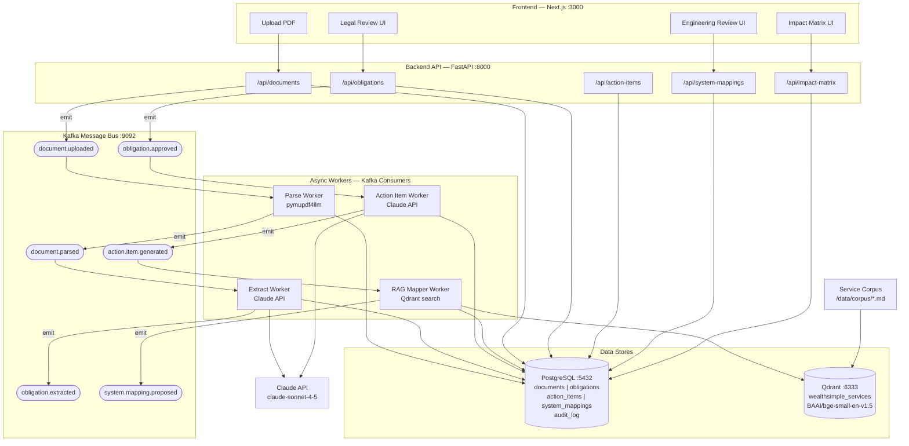

# RIDE — Regulatory Integrated Development Environment

RIDE is an event-driven platform that ingests regulatory PDF documents, extracts legal obligations using AI, and maps them to internal engineering systems through a human-in-the-loop review pipeline.

## Architecture



## Data Flow

| Stage | Trigger | Actor | Output |
|-------|---------|-------|--------|
| **1. Upload** | User drops PDF | Frontend → API | `document.uploaded` event |
| **2. Parse** | `document.uploaded` | Parse Worker + pymupdf4llm | Markdown stored, `document.parsed` event |
| **3. Extract** | `document.parsed` | Extract Worker + Claude | Obligations created (status: pending) |
| **4. Legal Review** | Human approves/rejects | Legal reviewer via UI | `obligation.approved` event + audit log |
| **5. Action Items** | `obligation.approved` | Action Item Worker + Claude | Actionable tasks generated |
| **6. System Mapping** | `action.item.generated` | RAG Mapper + Qdrant | System mapping proposals with confidence scores |
| **7. Engineering Review** | Human confirms/corrects | Engineer via UI | Confirmed mappings + audit log |
| **8. Impact Matrix** | Query confirmed mappings | API aggregation | Systems x Obligations grid |

## Stack

| Layer | Technology |
|-------|-----------|
| Frontend | Next.js 15, Tailwind CSS, shadcn/ui |
| Backend API | FastAPI, SQLAlchemy, Alembic |
| Message Queue | Apache Kafka (KRaft mode) |
| Database | PostgreSQL 16 |
| Vector Store | Qdrant + BAAI/bge-small-en-v1.5 |
| AI | Claude claude-sonnet-4-5 (structured output) |
| PDF Parsing | pymupdf4llm |
| Orchestration | Docker Compose |

## Getting Started

```bash
# Start all services
docker compose up -d

# Frontend:  http://localhost:3000
# Backend:   http://localhost:8000
# API docs:  http://localhost:8000/docs
# Qdrant:    http://localhost:6333/dashboard
```
