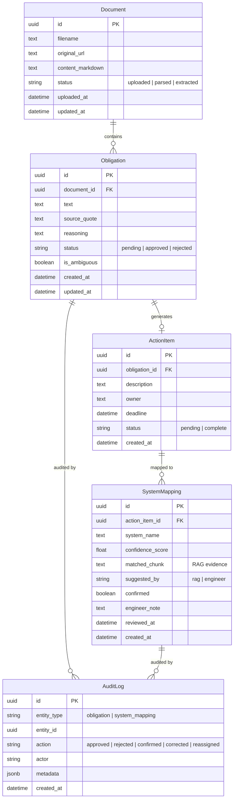

# RIDE: Entity Relationship Diagram

Shows the core domain entities and their relationships. The data model follows the pipeline flow: Documents contain Obligations, which generate ActionItems, which are mapped to Systems. AuditLog provides polymorphic audit trailing across entities.

## Key Relationships

| Relationship | Cardinality | Notes |
|-------------|-------------|-------|
| Document -> Obligation | 1:N | One regulatory document yields many obligations |
| Obligation -> ActionItem | 1:1 | Each approved obligation generates one action item |
| ActionItem -> SystemMapping | 1:N | One action item may affect multiple systems |
| AuditLog -> (polymorphic) | N:1 | Tracks actions on Obligations and SystemMappings via entity_type + entity_id |
