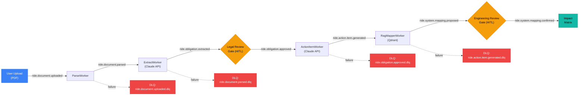

# RIDE: Event-Driven Pipeline Flow

Shows the complete document processing pipeline from upload through impact matrix generation. Two human-in-the-loop (HITL) gates ensure transparency: legal reviewers approve obligations, engineers confirm system mappings. Dead letter queues (DLQ) handle worker failures at each stage.

## Pipeline Stages

| Stage | Kafka Topic | Worker | External Dependency |
|-------|------------|--------|-------------------|
| 1. Upload | `ride.document.uploaded` | ParseWorker | - |
| 2. Parse | `ride.document.parsed` | ExtractWorker | Claude API |
| 3. Extract | `ride.obligation.extracted` | (Legal Gate) | Human reviewer |
| 4. Legal Approve | `ride.obligation.approved` | ActionItemWorker | Claude API |
| 5. Action Items | `ride.action.item.generated` | RagMapperWorker | Qdrant |
| 6. RAG Map | `ride.system.mapping.proposed` | (Engineering Gate) | Human engineer |
| 7. Eng Confirm | `ride.system.mapping.confirmed` | Impact Matrix | - |
