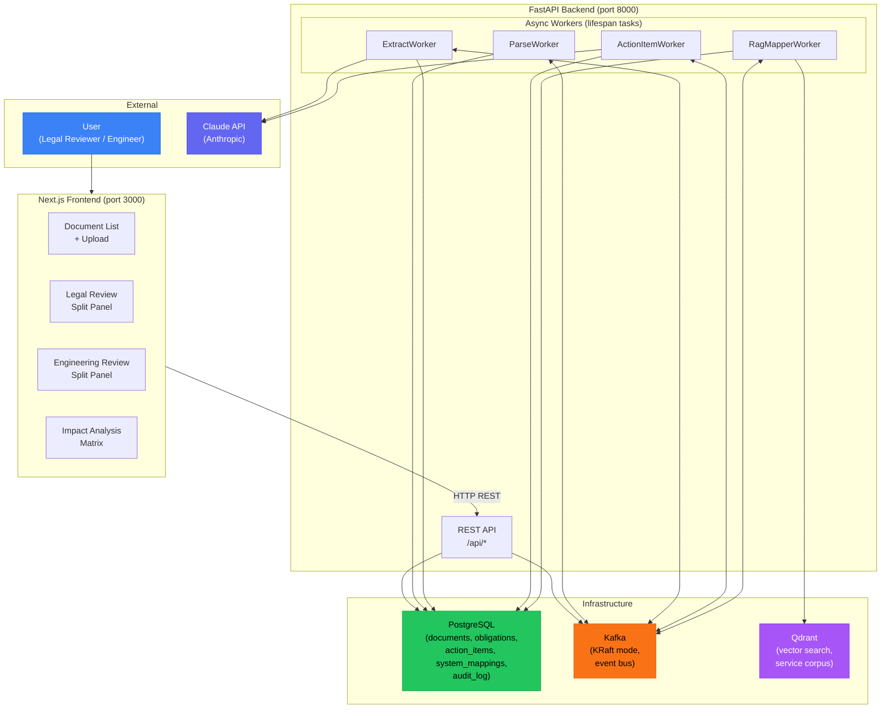

# RIDE: System Context Diagram

Shows the external actors, services, and infrastructure that comprise the RIDE system. The architecture follows a microservices-inspired pattern with an event bus (Kafka) decoupling the processing stages.

## Technology Stack

| Component | Technology | Role |
|-----------|-----------|------|
| Frontend | Next.js 15, React, Tailwind CSS | Server-rendered UI with client interactivity |
| Backend API | FastAPI, SQLAlchemy 2.0 (async) | REST endpoints, worker orchestration |
| Database | PostgreSQL 16 | Persistent storage for all domain entities |
| Event Bus | Apache Kafka 3.9.2 (KRaft) | Decoupled async pipeline communication |
| Vector DB | Qdrant | RAG corpus storage and similarity search |
| AI | Claude (Anthropic) | Obligation extraction, action item generation |
| Container | Docker Compose | Development orchestration |
